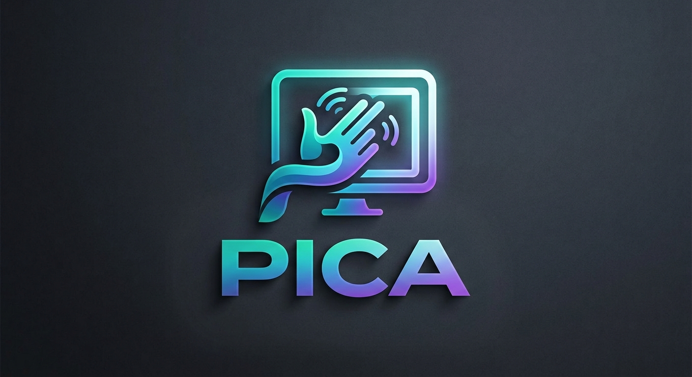

<p align="center">
  
</p>

# Pica

Control your PC with hand gestures. Python, MediaPipe hand tracking, and a small
PyTorch classifier trained on your own recorded gestures.

## Setup

```
py -m pip install -r requirements.txt
```

## Gestures

| Gesture | Action |
|---|---|
| `open_palm` | move the cursor (tracks your wrist position) |
| `close_palm` | left click |

Edit `config/config.yaml` to remap gestures to actions, or add new ones (see below).

## Usage

### 1. Record gesture samples

```
py collect.py open_palm --num-samples 100
py collect.py close_palm --num-samples 100
```

A camera window opens with a live sample counter — hold the gesture steady while it
records. Press `q` to stop early. Samples are saved to `data/annotations/<label>.npy`.

### 2. Train the classifier

Open `notebooks/02_train_model.ipynb` and Run All. It reads every `.npy` file in
`data/annotations/`, normalizes the landmarks, trains a small MLP, and saves
`models/gesture_classifier.pth`.

### 3. Run it live

```
py main.py
```

Shows a debug window with your hand skeleton and the predicted gesture + confidence.
Press `q` to quit.

## Adding a new gesture

1. Add it to `config/config.yaml` under `gestures:` (or as `cursor.gesture` if it should
   drive the mouse), mapped to an action.
2. If the action doesn't exist yet, add it to `_run_action` in
   `src/components/system_control.py`.
3. Record samples: `py collect.py <name> --num-samples 100`
4. Retrain: run `notebooks/02_train_model.ipynb`.

## Project layout

```
Pica/
├── config/config.yaml       # gesture -> action map, camera id, confidence/cursor tuning
├── collect.py                # standalone gesture-recording script
├── main.py                   # entry point for the live app
├── data/                     # recorded samples (gitignored)
├── models/                   # trained classifier + MediaPipe model asset
├── notebooks/                # data collection + training notebooks
└── src/
    ├── components/           # camera_stream, hand_tracker, classifier, system_control
    ├── pipeline/run_app.py   # wires camera -> tracker -> classifier -> system_control
    └── utils/                 # landmark normalization, config loader, debug overlay
```

## Troubleshooting

- **Camera window doesn't appear in VS Code's Jupyter notebook**: OpenCV's window
  backend is unreliable inside a Jupyter kernel on Windows. Use `collect.py` from a
  plain terminal instead — same result, no GUI conflicts.
- **`FileNotFoundError` for `gesture_classifier.pth`**: you haven't trained yet — run
  step 2 above.
- **Cursor jumps when clicking**: the cursor gesture tracks the wrist (stable), not a
  fingertip (moves as fingers curl) — if you change `cursor.landmark_index`, keep this
  in mind.
